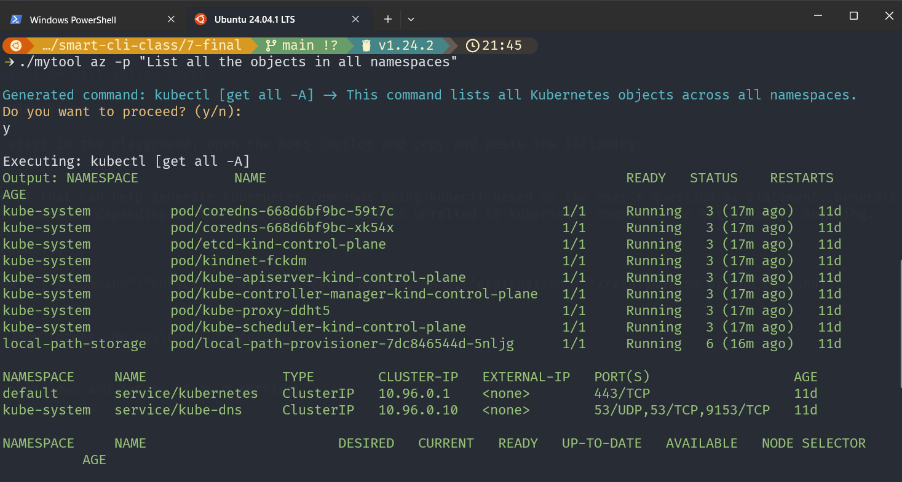
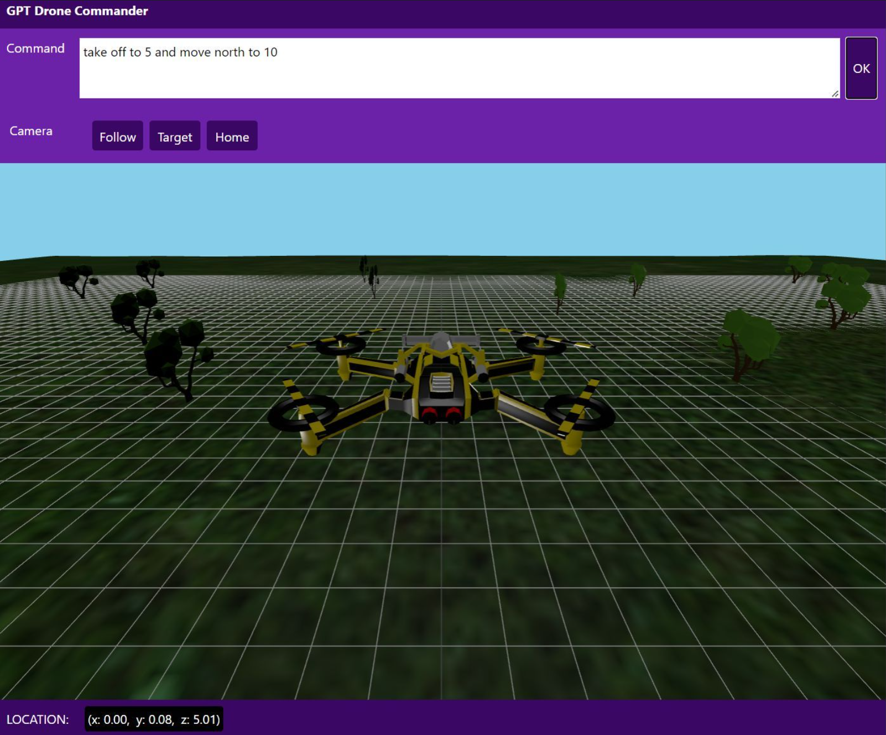

# Class: Building a smart Go CLI application

This is content for a class on building a smart command-line interface application using OpenAI and Go.

## 1.0 - Requirements

- Intro-intermediate Go knowledge
- OpenAI endpoint and key
- A kubernetes cluster and ability to execute kubectl commands

## 2.0 - My rules

- Always start in the playground
- Calling an LLM is easy, what is difficult is the everything else (in this case Go programming)
- He or she who can prompt engineer and stuff the prompt gets the riches
- In prompt engineering, a prompt can be though of as a semantic program (input, instructions, output)

## 3.0 - Foundational concepts

- Calling an LLMs with REST over using SDK
  - No package dependecies, supported in languages where packages may not be available, full control of performance, retries, etc.
- Context window
  - Used to be 8k now up to 128k and growing
- Instruct vs chat completion model
  - Instruct: prompt
  - Chat: messages
- Chat conversation management
  - Message types:
    - system
    - user
    - assistant
    - [Diagram](https://github.com/msalemor/llm-use-cases/blob/main/images/context-chat-history.png)
- OpenAI response format: text vs json_object

### 3.1 - Approaches to Integrating LLMs

| Approach | Pros | Cons | Use Cases |
|----------|------|------|-----------|
| **REST API** | - No dependencies<br>- Works in any language<br>- Full control over requests<br>- Easy to customize | - Requires manual error handling<br>- More boilerplate code<br>- Manual rate limiting | - Lightweight integrations<br>- Languages without official SDKs<br>- Custom retry logic needs |
| **Azure/OpenAI SDK** | - Simplified API calls<br>- Built-in error handling<br>- Type safety<br>- Automatic retries | - Dependency on SDK version<br>- Less flexibility<br>- Limited to supported languages | - Standard applications<br>- Rapid development<br>- When type safety is important |
| **AI Agents (Assistants API)** | - Persistent state<br>- Built-in memory & context<br>- Tool calling capabilities<br>- File handling | - Higher latency<br>- Less control over execution<br>- More complex setup | - Multi-turn conversations<br>- Knowledge-base applications<br>- Long-running assistants |
| **Semantic Kernel** | - Component-based architecture<br>- Plugin system<br>- Memory & context management<br>- Cross-platform (C#, Python, Java) | - Additional abstraction layer<br>- Learning curve<br>- Overhead for simple use cases | - Enterprise applications<br>- Complex workflows<br>- Cross-platform scenarios<br>- Plugin-based architectures |
| **AutoGen** | - Multi-agent orchestration<br>- Agent collaboration<br>- Human-in-the-loop support<br>- Autonomous workflows | - Steep learning curve<br>- Complex configuration<br>- Higher computational overhead | - Complex reasoning tasks<br>- Multi-step problem solving<br>- Research applications<br>- Agent-based systems |

## 4.0 - What are we building?




## 5.0 - Steps we will follow today

### 5.1 - Playground

- We will start in the playground, open the M365 Copilot and copy and paste the following:
```text
system:
You are an AI that can help generate Kubernetes commands using kubectl based on the user's question or statement. Generate one or more commands depending on the ask. If the request is unralted to kubernetes commands, do not generate anything.

Response example:
{
  "commands": [ {"command":"kubectl", "args": ["get","nodes","-A"], "explanation":""//explanation of the command}],
}

Repond in JSON format. No epilogue or prologue.

user:
Create an nginx pod and expose it as a service.
```

#### Results

```json
{
  "commands": [
    {
      "command": "kubectl",
      "args": ["run", "nginx-pod", "--image=nginx"],
      "explanation": "This command creates a new pod named 'nginx-pod' using the nginx image."
    },
    {
      "command": "kubectl",
      "args": ["expose", "pod", "nginx-pod", "--port=80", "--target-port=80", "--name=nginx-service"],
      "explanation": "This command exposes the 'nginx-pod' as a service named 'nginx-service' on port 80."
    }
  ]
}
```

### 5.2 - Project structure

Create the following structure:
```bash
mkdir mytool
mkdir -p mytool/cmd
mkdir -p mytool/pkg
cd mytool
touch main.go
touch cmd/rootcmd.go
```

### 5.3 - Create the go module

Create a go module
```bash
cd mytool && go mod init mytool
```

### 5.4 - Create a `./mytools.json` file

```json
{
	"endpoint": "https://<NAME>.openai.azure.com/openai/deployments/gpt-4o/chat/completions?api-version=2024-02-15-preview",
	"model": "gpt-4o",
	"api_key": "<KEY>",
	"system_prompt": "You are an AI that can help generate Kubernetes commands using kubectl based on the user's question or statement. Generate one or more commands depending on the ask.\nExample:\n{\n  \"commands\": [ {\"command\":\"kubectl\", \"args\": [\"get\",\"nodes\",\"-A\"], \"explanation\":\"\"//explanation of the command}],\n}\nRepond in JSON format. No epilogue or prologue."
}
```

## 6.0 - Creating the app

### 6.1 - Basic CLI

[Cobra](https://github.com/spf13/cobra) is a Go package for building CLI application.

User story - Basic CLI

As a user I need to be able to execute `mytool --help`.

- Requirements:
  - Create a cobra root command called `cmd/rootcmd.go`
  - All subcommand should take a required prompt argument `--prompt or -p`
  - Create a the `./main.go` file and call the rootcmd

- Criteria:  
  - You should be able to build go code and execute `go run . --help`  

- [Code](/1-rootcmd)

### 6.2- Global Setting

User Story - Global Setting

As as an application, I need to be able to load the JSON settings.

- Requirements:
  - Create a setting `pkg/settings.go` singleton that reads the `./mytool.json` file with the following settings:
    - endpoint:string, api_key:string, model:string, system_prompt:string
  - Create a structure to load these settings
  - Panic of these keys are not provided when the application starts
  - Settings should be the first item that is loaded when the application runs

- Criteria:  
  - Application should load the `./mytools.json` 
  - The application fails if any of the settings are missing
  - The application compiles and runs: `go run . -- help`

- [Code](/2-settings)

### 6.3 - Required sstructures

User story - Required sstructures

As an application, I need to make the required supporting structure available to the application.

- Requirements:
  - Create the following structures at `pkg/types.go`:
    - Message (Role:string, Content:string)
    - Choice (Id:string, Message:Message)
    - ResponseFormat (Type string)
    - OpenAIRequest(Messages []Message, Model string, ResponseFormat ResponseFormat, Temperature float)
    - OpenAIResponse(Choices []Choice)
    - Command (command:string,args:[]string,explanation)
    - Commands (Commands []Command)

- Criteria:
  - The application compiles and runs: `go run . -- help`

- [Code](/3-structures/)

### 6.4 - Process commands execution

User Story - Process commands execution

As an application I need to execute terminal commands.

- Requirements:
  - Create a `pkg/process.go` file to process the commands
  - Create function called `ProcessCommands(commands *Commands)`
  - Use `cmd := exec.Command(command.Command, command.Args...)`
  - Use `github.com/fatih/color` to colorize the text
    - Green: results
    - Yellow: confirmations
    - Orange: warnings
    - Red: errors

- Criteria:  
  - Create a mock commands structure
  - Test it from main before starting the CLI
  - The application compiles and runs: `go run . --help`

- [Code](/4-process/)

### 6.5 - Call OpenAI Chat completion

User Story - Call OpenAI Chat completion

As an application, I need to call OpenAI Chat completion to process a prompt and get a completion.

- Requirements:
  - Create a `pkg/openai.go` file and create a function called `ChatCompletion` to make a POST request to OpenAI.
  - This function should receive an OpenAIRequest and return a pointer to the Commands object: `ChatCompletion(prompt string) (*Commands, error)`
  - Use the Setting singleton to get the endpoint, api key, model, and system prompt
  - To call OpenAI use the OpenAIRequest structure
  - To receive the respose from OpenAI use the OpenAIResponse structure
  - Convert the actual OpenAIResponse into a pointer to the Commands structure

- Criteria:
  - You should be able to test a completion by adding in `main.go`
```go
cmds, _ := pkg.ChatCompletion("List all pods")
fmt.println(cmds)
```
  - The application compiles and runs: `go run . --help`


- [Code](/5-openai)

### 6.6 - Kubernetes Subcommand

User Story - Kubernetes Subcommand

As a user in need to be able to type `mytool az -p "Instructions"` and have the tool generate kubectl commands from my instructions and process the commands.

- Requirements:  
  - Add a cobra subcommand called `cmd/azcmd.go`
  - Add the subcommand to the roocmd
  - When the user calls this subcommand, it should call the chatcompletion with the command prompt, get a commands structure pointer, and pass this pointer to the ProcessCommands in `pkg/process.go`

- Criteria:
  - The application compiles: `go build .`
  - You should be able to get the help for the subcommand `go run . az --help`

- [Code](/6-azcmd/)

### 6.7 - The final product

Code: [Final code](/7-final)


## 7.0 - Improvements

- Add more CLIs (docker, az, azd, azcopy, helm, etc.)
- Add other abilities (scaffold code, code review, etc.)
- Enhanced security, move to a package that support DefaultAzureCredentials

- Most of this code was created with this command:

```bash
cai scaffold -p "Create a Go cobra cli called mytool. Create a root command (cmd/rootcmd.go) in the cmd folder, and run the root command from `./main.go`. Create subcommand called `cmd/azcmd. go` to run kubernetes commands and add it to root command. The cli should require one parameter called `prompt` for all subcommands. Create a pkg folder and create four files. One should create a `pkg/types.go` file to structure for the following:. The other file should be `pkg/openai.go` to call a chat completion using a rest post command with the request and response objects. Call the third file, `pkg/settings.go`. This file should be able to read `mytool.json`, create a structure (endpoint:string,apikey:string,system_prompt:string,prompt:string), and expose the settings a a singleton. Create `pkg/process.go`. This file should receive a pointer to commands and process each command using exec.command."
```

## 7.1 - What else

